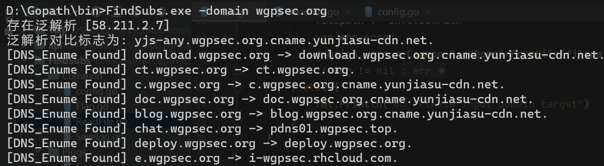
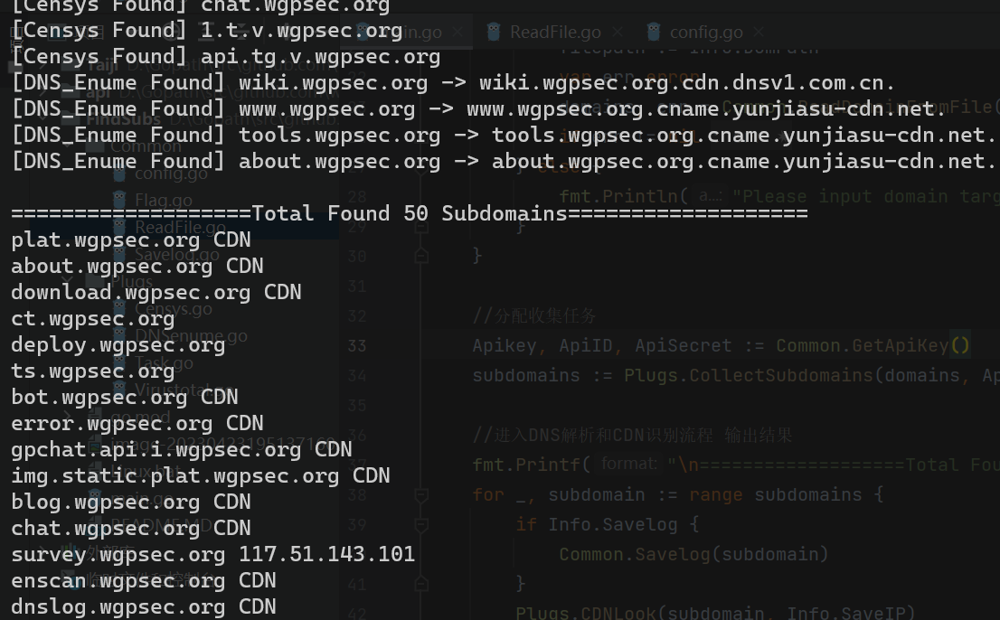
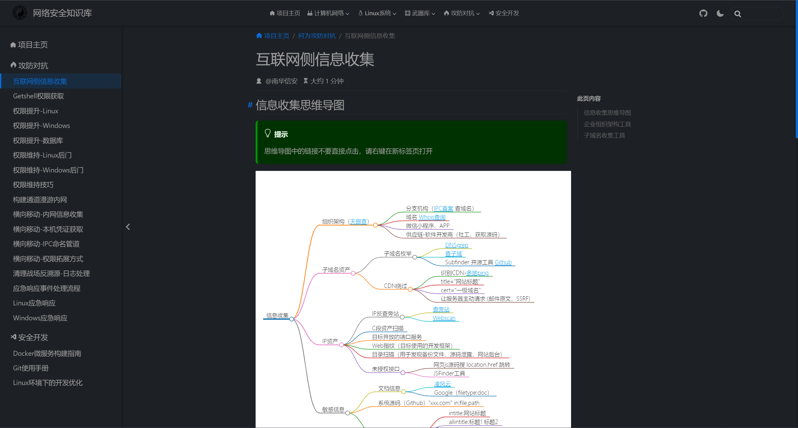

## 功能设计

总体设计子域名收集的功能和实现思路

1）子域名枚举   （通过调用网络API接口+DNS爆破phpinfo.me的3k字典 收集的很全且快）
2）CDN识别      （把域名解析为IP地址，过程中识别CDN，非CDN的IP可以单独导出）
3）子域名指纹识别 （交给`Taiji`端口扫描器扫描Web端口并识别应用指纹）

## 使用方法

1）先在当前目录下的配置文件`api-key.ini`中填写好API key

```bash
#YOUR_VIRUSTOTAL_API_KEY
ApiKey=axxxx77eb12345ce53608fb870bec24efb2bfebd65230f65b5a2e7ae66666666

#YOUR_CENSYS_API_ID
ApiID=0d112abc-2689-13a4-810e-sbcxadc12345

#YOUR_CENSYS_API_SECRET
ApiSecret=Jabcdea8oMBgw0GkcSAREKB5rD123456
```

2）工具选项

```bash
FindSB.exe -h

Usage of FindSB.exe:
  -domain string
        The root domain of target #目标根域名，比如 google.com
  -domfile string
        The root domains file of target (default "./domains.txt") #从文件中读取根域名列表
  -ips
        Save ips to ./ips.txt   	#把解析到的IP保存到当前目录下的ips.txt中
  -log
        Save log to ./domlog.txt	#将所有子域名保存到当前目录下的domlog.txt中
```





编码实现
----------

### 一、调用API接口收集子域名

virustotal https://developers.virustotal.com/reference/subdomains
censys     https://search.censys.io/api#/

收集到的子域名会自动进行去重处理

### 二、字典爆破DNS&泛解析处理

用Golang的Nslookup函数实现DNS域名爆破 ，同时可判断CDN。

#### 何为泛解析？

泛域名解析是一种特殊的域名解析方式。它使用通配符形式，设置域名解析。

> 域名解析是：子域名.域名  解析到同一IP
> 泛域名解析是：*.域名        解析到同一IP

在子域名解析中，每个子域名都会解析为一个特定的IP地址，只有被设置解析，用户才能正常访问，输入错误的子域名则无法访问。泛解析可以将没有明确设置的子域名一律解析到一个IP地址上。这样，即使用户输入错误的子域名，也可以访问到域名持有者指定的IP地址。

但是信息收集中，这会造成请求的所有子域名都能访问的假象，从而收集到一堆无效的子域名。

#### 泛解析处理思路

1）先判断是否存在泛解析：用一个绝对不存在的子域名去解析A记录，如有记录则存在泛解析
2)  用不存在的子域名提取CNAME记录，作为泛解析对比标志
3）接下来的流程用Lookupcname解析剩余子域名，与泛解析标志做对比，如果不一样并且不为空则此子域名存在。

## 网络安全知识库(推荐)

### 地址：https://wintrysec.github.io

